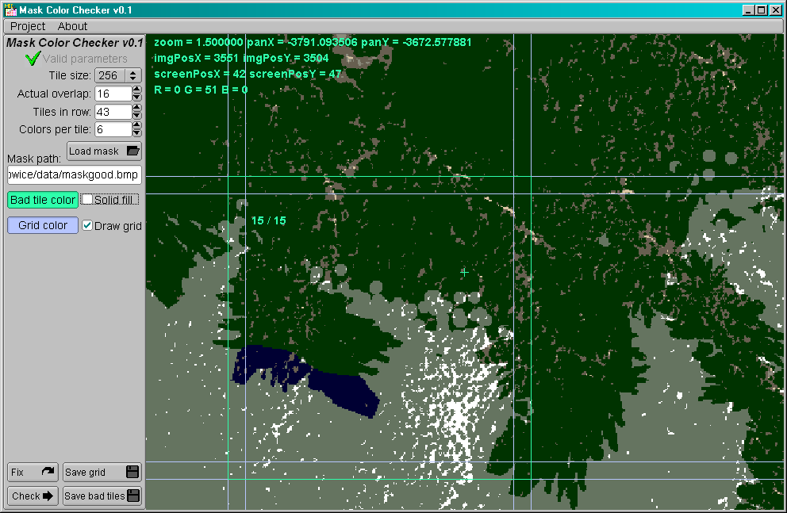
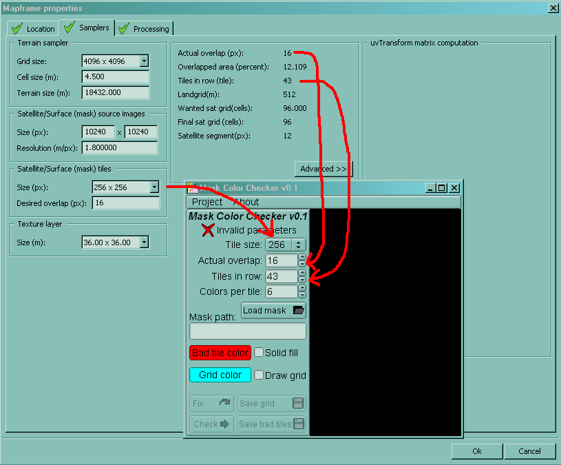

# Mask Color Checker
This program checks terrain surface mask validity for modded terrains for games from the Arma series and DayZ. Among the most common faults is the colour count of a mask tile exceeding the limit. This program detects such faults and tells the user where they are, or fixes it automatically using a heuristic approach.

## Usage
Load the 24bit BMP mask image into the program, and set the correct parameters in the interface:
- Actual overlap: Mapframe properties > Samplers > Actual overlap (px)
- Tiles in row: Mapframe properties > Samplers > Tiles in row (tile)
- Colors per tile: Mapframe properties > Processing > Imagery > Options > Export surface mask

After the correct parameters are entered and the mask is loaded, you can press the Check button. This will scan the entire image for faulty tiles. After it's done scanning, the faulty tiles will be displayed on the canvas. The canvas can be panned around using the right mouse button, and zoomed in/out using the scroll wheel. You can set the color of the displayed faulty tiles, and set whether they should be drawn as just a frame or a solid rectangle. A grid can also be enabled to better show the borders between tiles and their overlap.

You can save the bad tiles to a image and load it into a painting program of your choice. The "Solid fill" option applies to this image too.

You can try fixing the mask automatically, this will replace the rarest colors in the entire tile with the most common color. Edges and corner fragments (overlapping with other tiles) of the tile are handled differently to avoid introducing new colors into neighbouring tiles, unless said fragment consists entirely of the rarest colors that are to be replaced. In such a case, the entire fragment is repainted with the most common color in the tile. This has a very low chance of introducing new colors to neighbouring tiles.

The output from the automatic fix can be used to generate a difference mask against the original mask, which can facilitate manual fixing.

## Download
The Windows executable can be found here:
https://github.com/CyprinusCarpio/MaskColorChecker/releases

## Compilation
C++17 compiler, and FLTK 1.4 or newer is required (https://github.com/fltk/fltk)

## Acknowledgements
This project is based in part on the works of the following projects:
- FLTK (https://www.fltk.org/)
- STB (https://github.com/nothings/stb)
- cpptoml (https://github.com/skystrife/cpptoml)

Thanks to Pennyworth et al. for documenting the mapframe properties (https://github.com/pennyworth12345/A3_MMSI/wiki/Mapframe-Information)